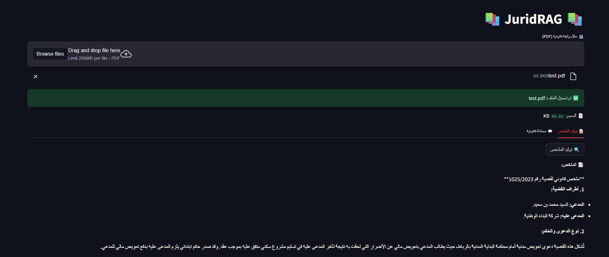
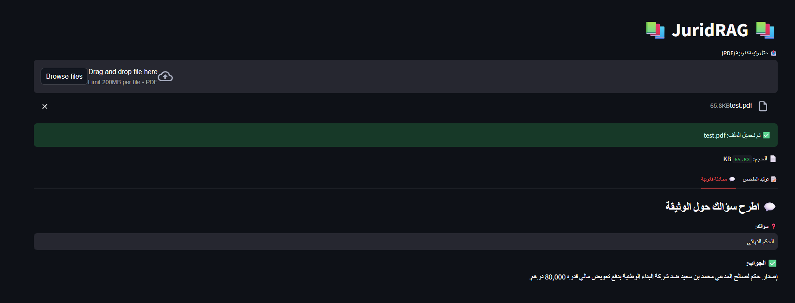

## JuridRAG – Intelligent Legal Document Assistant for Moroccan Law

**JuridRAG** is an AI-powered legal assistant built with [Streamlit](https://streamlit.io/) and [LangChain](https://www.langchain.com/) that enables summarization and interactive Q\&A on Arabic legal documents. It supports both text-based and scanned PDF files via OCR.

---

## Features

*  **Automatic summarization** of Arabic legal documents
*  **Interactive legal assistant** powered by Retrieval-Augmented Generation (RAG)
*  Support for both **text-based** and **scanned PDFs** via OCR
*  Integrated with **Google Gemini** via the `langchain-google-genai` package

---

## Project Structure

```
juridrag/
│
├── app.py                         # Main Streamlit application
├── logic.py                       # Summarization and RAG chain logic
├── utils.py                       # PDF loader, splitter embeddings, vector store
├── prompts/
│   ├── chat_prompt.py             # Arabic chat prompt template
│   └── summary_prompt.py          # Arabic summarization prompt
├── .env                           # Contains the Google API key
├── requirements.txt               # Python dependencies
└── README.md                      
```

---

## Getting Started

### 1. Install dependencies

```bash
pip install -r requirements.txt
```

### 2. Add your API key

Create a `.env` file in the root directory:

```env
GOOGLE_API_KEY=your_google_genai_key_here
```

---

## Run the App

```bash
streamlit run app.py
```

---

## Example Usage

1. Upload an Arabic legal document (PDF)
2. Click **"🔍 Generate Summary"** to summarize the full content
3. Ask a legal question and receive a direct, contextual answer

---

## Screenshots





---